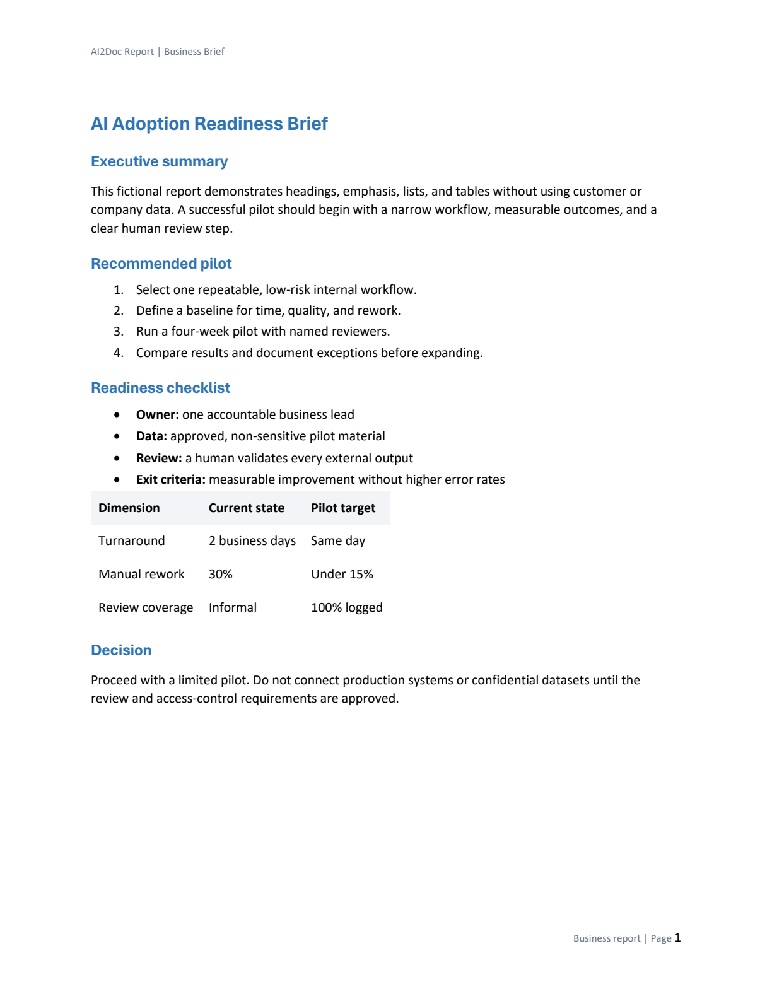
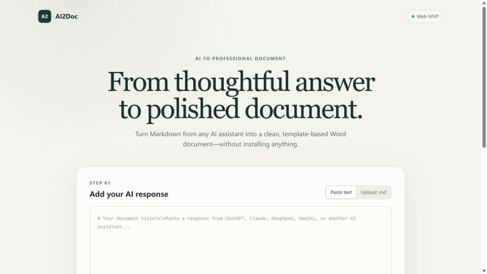
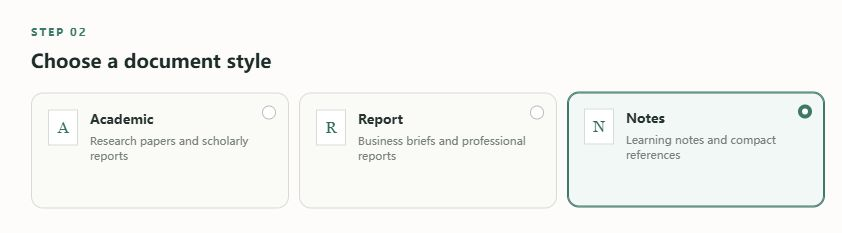
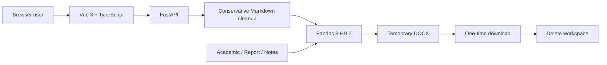

# AI2Doc

> Turn AI conversations into beautiful professional documents.

AI2Doc 将 ChatGPT、DeepSeek、Claude、Gemini 等 AI 工具产生的 Markdown 回答，转换为结构清晰、样式统一、可以继续编辑的 Word 文档。

它不是简单的 Markdown 转换器，而是一条专门面向 AI 内容的文档生成工作流：粘贴或上传、选择专业模板、生成 DOCX、安全下载。

> **Current status:** Milestone 1.9 release preparation. Web MVP、真实 Pandoc 转换和本地浏览器闭环已经通过；`v0.1.0` 仍需 GitHub Actions 首次运行和干净 Docker 环境冷启动。

## Demo

### Before — AI content

```markdown
# AI Adoption Readiness Brief

## Recommended pilot

1. Select one repeatable workflow.
2. Define measurable outcomes.
3. Keep a human review step.

| Dimension | Current | Target |
|---|---|---|
| Turnaround | 2 days | Same day |
```

### After — professional DOCX



完整的脱敏输入位于 [`examples/`](examples/)。

## Screenshots

### Web converter



### Template selection



## MVP capabilities

- 粘贴 AI 回答或上传 UTF-8 `.md` / `.markdown` 文件
- 选择 Academic、Report 或 Notes reference DOCX
- 支持标题、段落、列表、表格和常用 Markdown
- 将常用 LaTeX 公式转换为可编辑的 Word 原生 OMML
- 生成并下载 `AI2Doc_Report.docx`
- 使用一次性下载令牌，下载完成后删除任务文件
- 不调用商业 AI API，不保存用户历史，不需要数据库

未来方向见 [`ROADMAP.md`](ROADMAP.md)。当前不会提前实现用户系统、云存储、AI 增强或浏览器插件。

## Three-minute quick start

### Requirements

- Git
- Docker Engine or Docker Desktop
- Docker Compose v2

克隆仓库并启动：

```bash
git clone https://github.com/Leo070506/AI2Doc.git
cd AI2Doc
docker compose up --build
```

打开 [http://localhost:8080](http://localhost:8080)，粘贴一段 AI 回答，选择模板并点击 **Generate DOCX**。

停止服务：

```bash
docker compose down
```

> 当前验证机没有 Docker CLI；真实容器闭环仍是发布门禁。环境记录见 [`docs/docker-validation.md`](docs/docker-validation.md)，完整冷启动验收表见 [`docs/docker-e2e-validation.md`](docs/docker-e2e-validation.md)。

## Local development

### Backend

```bash
cd backend
python -m venv .venv

# activate the environment, then:
pip install -r requirements-dev.txt
uvicorn app.main:app --reload --port 8000
```

Pandoc 必须位于 `PATH`，或通过 `AI2DOC_PANDOC_PATH` 指向可执行文件。

### Frontend

```bash
cd frontend
npm install
npm run dev
```

打开 [http://localhost:5173](http://localhost:5173)。Vite 会把 `/api` 和 `/health` 代理到本地后端。

完整配置、测试和故障边界见 [`docs/mvp-development.md`](docs/mvp-development.md)。

## Tests

```bash
cd backend
python -m pytest

cd ../frontend
npm run typecheck
npm run build
```

GitHub Actions 会在提交和 Pull Request 中运行 Python 3.12/3.13/3.14 后端矩阵，以及 Node.js 24 前端类型检查和生产构建。

首次 GitHub 托管运行的验证状态见 [`docs/github-ci-validation.md`](docs/github-ci-validation.md)。

## Architecture



- **Frontend:** Vue 3、TypeScript、Vite、Tailwind CSS
- **Backend:** Python、FastAPI、Pandoc
- **Deployment:** Nginx + FastAPI through Docker Compose
- **Storage:** isolated local temporary directories; no permanent user-content store

See [`docs/architecture.md`](docs/architecture.md) and [`docs/api-design.md`](docs/api-design.md) for module and API contracts.

## Repository layout

```text
AI2Doc/
├── .github/
│   ├── workflows/              # backend and frontend CI
│   ├── ISSUE_TEMPLATE/         # structured community reports
│   └── PULL_REQUEST_TEMPLATE.md
├── backend/                    # FastAPI service and tests
├── frontend/                   # Vue 3 Web application
├── templates/                  # academic, report, notes reference DOCX
├── examples/                   # public, synthetic Markdown samples
├── docs/                       # architecture, validation, screenshots
├── docker-compose.yml
├── CONTRIBUTING.md
├── SECURITY.md
└── LICENSE
```

## Security and privacy

AI2Doc limits input/output size, accepts only whitelisted templates, invokes Pandoc without a shell, and deletes temporary workspaces after download. The MVP does not include authentication or rate limiting and should not be exposed directly to the public internet without deployment controls.

Please read [`SECURITY.md`](SECURITY.md) before reporting vulnerabilities. Never include private AI conversations or confidential files in public Issues.

## Contributing

Bug reports, documentation fixes, tests, and focused improvements are welcome. Read [`CONTRIBUTING.md`](CONTRIBUTING.md) before opening a Pull Request.

## Releases

首个公开版本正在准备中。版本变化见 [`CHANGELOG.md`](CHANGELOG.md)，`v0.1.0` 的待发布说明见 [`docs/releases/v0.1.0.md`](docs/releases/v0.1.0.md)。

## License

AI2Doc is released under the [MIT License](LICENSE).
