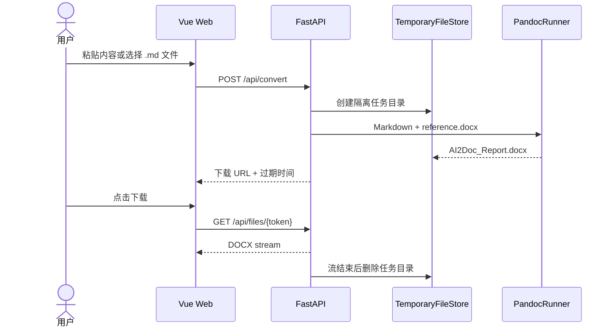

# AI2Doc Web MVP API

## 1. 状态与边界

- 状态：Milestone 1 implementation contract
- 基础路径：同源 `/api`
- 认证：无（MVP）
- 存储：单实例本地临时目录
- 最大输入：默认 1 MiB，可通过环境变量调整
- 输出：固定为 DOCX

本轮只实现创建转换和一次性下载，不提供用户、历史记录、任务列表、数据库或云存储。

## 2. 转换流程



## 3. `POST /api/convert`

创建一个文档并返回短时有效、单次使用的下载地址。

### 3.1 JSON 输入

`Content-Type: application/json`

```json
{
  "content": "# Project Notes\n\nAI-generated content...",
  "template": "report"
}
```

### 3.2 Markdown 文件输入

`Content-Type: multipart/form-data`

| Field | Type | Required | Description |
| --- | --- | --- | --- |
| `file` | file | yes | UTF-8 `.md` 或 `.markdown` 文件 |
| `template` | string | yes | `academic`、`report` 或 `notes` |

文件上传与 JSON 文本使用同一个端点，但每次请求只能选择一种输入方式。

### 3.3 成功响应

`200 OK`

```json
{
  "status": "success",
  "file": "/api/files/HIGH_ENTROPY_TOKEN",
  "filename": "AI2Doc_Report.docx",
  "expires_at": "2026-08-14T13:00:00Z"
}
```

`file` 是同源相对 URL。前端不得推导服务器路径。

## 4. `GET /api/files/{token}`

下载生成结果。

成功响应：

```http
HTTP/1.1 200 OK
Content-Type: application/vnd.openxmlformats-officedocument.wordprocessingml.document
Content-Disposition: attachment; filename="AI2Doc_Report.docx"
Cache-Control: private, no-store
X-Content-Type-Options: nosniff
```

下载 token 是高熵、短时、单次使用凭证。服务在认领 token 后拒绝第二次下载，并在流式响应关闭后删除 DOCX 和任务目录。未下载或中断的文件由 TTL 清理器兜底。

## 5. 健康检查

### `GET /health/live`

进程存活返回：

```json
{
  "status": "ok"
}
```

### `GET /health/ready`

检查 Pandoc、三套模板和临时目录。全部可用时返回 `200`：

```json
{
  "status": "ready",
  "pandoc": "available",
  "templates": ["academic", "report", "notes"]
}
```

任一关键依赖不可用时返回 `503`，不暴露服务器绝对路径。

## 6. 错误格式

```json
{
  "status": "error",
  "error": {
    "code": "file_too_large",
    "message": "File too large",
    "request_id": "req_xxx"
  }
}
```

| HTTP | Code | Message | Scenario |
| --- | --- | --- | --- |
| 400 | `invalid_request` | `Invalid request` | JSON/multipart 缺少字段或结构错误 |
| 413 | `file_too_large` | `File too large` | 请求正文或上传文件超过限制 |
| 415 | `unsupported_media_type` | `Unsupported media type` | 不是 JSON 或 multipart；文件扩展名不受支持 |
| 422 | `empty_content` | `Markdown content is empty` | 内容为空或清理后为空 |
| 422 | `invalid_template` | `Invalid template` | 模板不在白名单 |
| 422 | `invalid_encoding` | `Markdown file must use UTF-8 encoding` | 上传文件不是 UTF-8 |
| 404 | `file_not_found` | `File not found or already downloaded` | token 无效、已下载或已过期 |
| 500 | `conversion_failed` | `Conversion failed` | Pandoc 返回失败或输出无效 |
| 503 | `pandoc_unavailable` | `Pandoc unavailable` | Pandoc 不存在或不可执行 |

错误响应不包含正文、临时路径、命令行、堆栈或 Pandoc stderr。

## 7. Markdown 清理契约

MVP 只做保守、可预测的首尾清理：

- 移除 UTF-8 BOM
- 统一换行并删除首尾空行
- 仅当固定套话独占首行或末行时删除，例如“好的，我来回答你的问题”“希望对你有帮助”
- 不重写正文，不调用 AI，不删除内容中间出现的相同句子

清理后的内容始终以单个换行结尾。

## 8. 安全约束

- Pandoc 使用参数数组调用，`shell=False`
- 模板 ID 只映射到仓库中三条固定路径
- 内部文件名固定，不使用上传文件名构造路径
- 每个任务使用独立高熵目录
- Pandoc 设置超时、输出上限和受控工作目录
- 禁止用户传入 Pandoc 参数、Lua filter、reference DOCX 或资源路径
- 应用日志只记录 request ID、模板、耗时、状态和安全错误分类
