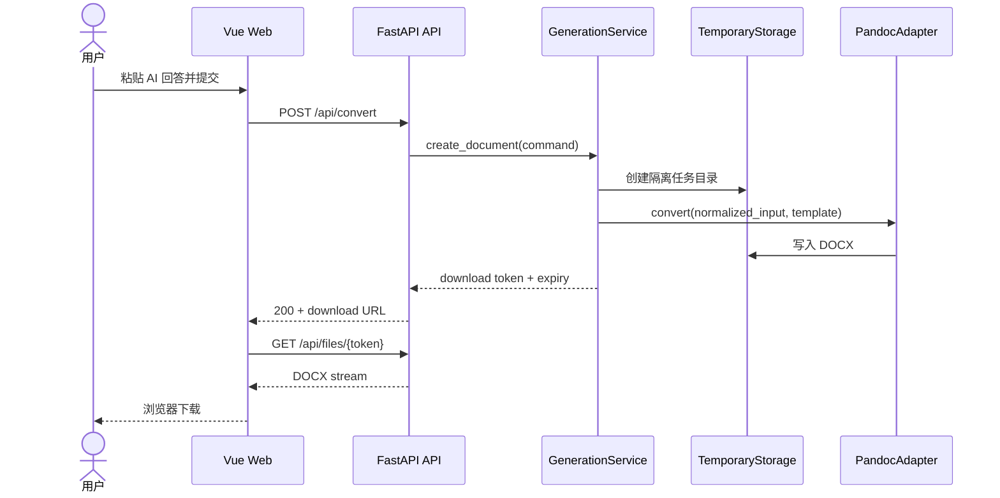

# AI2Doc 技术架构

## 1. 文档目的

本文定义 AI2Doc MVP 的系统边界、模块职责、关键数据流和非功能约束。它是实现前的基线，不是对未来所有功能的预先设计。实现中若发现假设不成立，应先更新文档并记录取舍。

## 2. 产品与系统边界

AI2Doc 接收用户主动提交的 AI 回答文本，将内容规范化并套用选定模板，通过服务器端 Pandoc 生成 DOCX，随后向用户提供短时有效的下载。

MVP 包含：

- 文本框粘贴和 UTF-8 Markdown 文件上传
- 常用 Markdown 结构和数学公式
- academic、report、notes 三个内置 reference DOCX 模板
- 同步 DOCX 生成、短时一次性下载和下载后删除
- 临时文件隔离与自动清理

MVP 不包含：

- 对 ChatGPT、DeepSeek、Claude、Gemini 的账号连接或内容抓取
- 商业 AI API 调用、内容重写或自动摘要
- 用户账号、历史文档、多人协作和长期云存储
- 浏览器插件、桌面客户端与移动客户端
- 用户上传任意 Pandoc 模板或执行自定义过滤器

## 3. 架构原则

1. **文档生成与传输协议分离：** HTTP 路由不直接调用 Pandoc。
2. **核心能力不绑定商业 AI：** 纯转换路径在没有模型服务时完整可用。
3. **外部工具通过适配器隔离：** Pandoc、文件存储和未来任务队列都有清晰接口。
4. **临时处理优先：** 默认不建立用户内容数据库，不在日志中记录正文。
5. **安全默认值：** 输入限额、模板白名单、转换超时和独立工作目录必须由服务端控制。
6. **先做模块化单体：** MVP 使用一个前端和一个后端服务，避免过早拆分微服务。
7. **可验证优先：** 每层使用稳定输入/输出契约，便于单元测试和端到端测试。

## 4. 系统上下文


浏览器只与 FastAPI 通信。Pandoc 不暴露为公共服务，也不接受未经校验的命令行参数。MVP 不需要数据库；任务元数据可先保存在有过期时间的进程内存储中，但实现前需验证多进程部署的影响。若启用多个后端实例，应换成共享任务状态与对象存储。

## 5. 后端模块

计划目录：

```text
backend/
├── app/
│   ├── main.py
│   ├── api/
│   ├── services/
│   ├── models/
│   ├── utils/
│   ├── templates/
│   └── storage/
├── tests/                    # 单元与真实 Pandoc 集成测试
└── requirements.txt          # 固定运行依赖
```

### `app/main.py`

应用组合入口。负责创建 FastAPI 实例、注册路由、中间件、异常处理器和生命周期钩子。它不包含转换流程、文件读写或 Pandoc 命令细节。

### `app/api/`

HTTP 边界层。负责：

- 路由与 API 版本
- 请求解析和输入校验
- 调用用例服务
- 将领域结果映射为 HTTP 状态码和响应模型

路由不直接访问文件系统或启动子进程。

### `app/services/`

应用用例与流程编排。MVP 的核心用例是同步转换、登记一次性下载和清理任务。服务依赖 Pandoc、模板目录和临时存储边界，不依赖 FastAPI 请求对象。

### `app/models/`

存放请求/响应契约、领域值对象和错误类型，例如任务状态、模板标识、文档元数据和生成选项。持久化模型若未来出现，应与公开 API 模型分开，避免存储结构泄漏到协议层。

### `app/utils/`

无业务状态的通用工具，例如受控文件名处理、时间与标识符帮助函数。任何包含业务规则、I/O 编排或第三方集成的逻辑都不应放入此目录。

### `app/templates/`

模板发现、元数据校验和 Pandoc 模板适配逻辑的边界。根目录 `templates/` 保存可分发模板资产；本模块只通过白名单模板 ID 访问这些资产，不接受来自请求的任意路径。

### `app/storage/`

任务文件生命周期和存储接口。MVP 实现本地临时存储，每个任务使用独立目录；未来可以替换为对象存储而不改变用例服务。

## 6. 前端模块

计划目录：

```text
frontend/
├── src/
│   ├── components/
│   ├── views/
│   ├── api/
│   ├── assets/
│   └── utils/
```

### `src/components/`

可复用、尽量无页面耦合的 UI 组件，例如内容编辑器、模板选择器、状态反馈和下载按钮。组件通过属性和事件交换数据，不直接拼接后端地址。

### `src/views/`

页面级视图与用户流程编排。MVP 只有生成工作台；后续页面扩展通过路由组织。

### `src/api/`

类型化 API 客户端、传输模型和统一错误映射。集中处理基础 URL、超时、取消请求和下载响应。

### `src/assets/`

全局样式、字体声明、图片和其他由构建系统管理的静态资源。文档模板不放在前端资源中。

### `src/utils/`

纯前端通用函数，例如显示格式化和浏览器下载帮助函数。请求状态与业务流程不藏在工具函数中。

## 7. 核心生成流程



Milestone 1 在创建请求内完成有超时的 Pandoc 转换，不引入外部任务队列。下载 token 只表示短时文件能力，不是持久任务资源。未来需要长任务时再引入任务状态接口。

## 8. 文档处理流水线

1. API 校验正文长度、内容类型、模板 ID 和可选元数据。
2. 服务创建不可预测的任务 ID 与独立临时目录。
3. 规范化换行、编码和允许的输入结构，不擅自改写用户语义。
4. 模板目录将模板 ID 解析为受信任的服务器端资产。
5. Pandoc 适配器使用参数数组启动受限子进程，配置超时并捕获受控错误。
6. 存储层检查结果类型、大小和归属后登记下载。
7. 响应只返回任务元数据，不暴露服务器路径。
8. 下载后可主动删除；无论是否下载，都在 TTL 到期后清理输入、输出和任务元数据。

## 9. 安全与隐私基线

- 仅接受 UTF-8 文本；限制请求体、文本长度、生成时间和输出大小
- 不把正文、公式内容、文件内容或完整 Pandoc 参数写入应用日志
- 模板 ID 使用白名单映射，拒绝绝对路径、父目录跳转和用户自定义过滤器
- 不启用可执行代码、网络资源抓取或任意 Lua filter
- 使用非 shell 的子进程调用、固定允许参数、低权限运行用户和转换超时
- 每个任务目录相互隔离；下载接口校验任务 ID，不接受原始文件路径
- 默认短 TTL，并保证正常完成、失败、超时和服务重启后的残留清理
- 生产环境限制来源、启用 HTTPS、安全响应头、速率限制和依赖漏洞检查

## 10. 部署拓扑

MVP 采用 Docker Compose：

- `frontend`：构建 Vue 静态资源，由轻量 Web 服务托管
- `backend`：运行 FastAPI，并在镜像内固定 Pandoc 版本
- 临时卷：仅承载短生命周期任务文件，不作为备份数据源

首版不默认引入数据库、Redis 或对象存储。达到多实例、长任务或高并发需求后，再通过存储和任务执行接口替换实现。

## 11. 可观测性与质量

- 为每个响应附加请求 ID，不记录用户内容
- 健康检查区分 API 存活与 Pandoc 可用性
- 单元测试覆盖解析边界、模板解析、状态转换和清理策略
- 集成测试使用固定输入与结构断言；避免只依赖 DOCX 二进制快照
- 端到端测试覆盖输入、生成、状态、下载与过期场景

## 12. Milestone 1 已冻结决策

1. 目标范围内的 TeX 数学语法由 Pandoc 直接生成 Word 原生 OMML，MVP 不增加公式预处理器。
2. 采用同步、带 30 秒超时的转换；MVP 不引入队列或持久任务模型。
3. DOCX 测试同时使用 OOXML 结构断言和 Microsoft Word 视觉渲染抽检。
4. 单页前端不引入路由、全局状态库或组件框架。
5. Pandoc 固定为 3.9.0.2；三套 reference DOCX 作为受版本控制的兼容资产。
