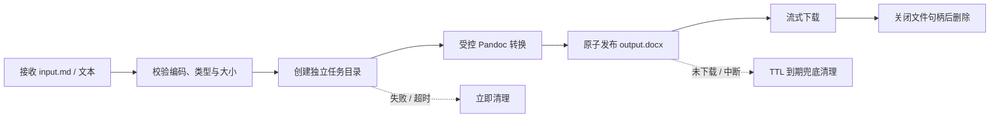

# AI2Doc MVP 文件生命周期设计

## 1. 目标

用户内容默认只为完成一次 DOCX 转换而存在。MVP 不建立文档历史数据库，不把正文写入日志，不把临时目录作为长期存储。

## 2. 生命周期



建议目录形态：

```text
temporary-root/
└── <high-entropy-task-id>/
    ├── input.md
    ├── working/
    └── output.docx
```

公共 API 永远只接触任务 ID，不接收或返回服务器路径。

## 3. 各阶段规则

### 接收与校验

- 只接受声明支持的 UTF-8 Markdown 文本
- 在写盘前限制请求体和字符数
- 规范化建议下载名，但内部文件固定使用 `input.md` 和 `output.docx`
- 模板通过白名单 ID 解析，不接受用户文件路径

### 工作目录

- 使用密码学安全的高熵任务 ID
- 每个任务独立目录，目录权限仅允许后端运行用户访问
- 不复用其他任务的输入、中间文件或输出
- 禁止路径跳转、符号链接逃逸和以用户文件名拼接内部路径

### 转换

- Pandoc 使用参数数组启动，不通过 shell 拼接用户内容
- 固定允许的输入格式、输出格式、reference DOCX 和参数集合
- 设置转换超时、输出大小上限和并发上限
- 不允许远程资源抓取、任意 Lua filter 或用户提供的可执行扩展
- 先写临时结果，结构校验通过后再原子重命名为 `output.docx`

### 下载与删除

- 结果就绪后删除 `input.md` 与不再需要的中间文件，只保留输出和最小任务状态
- 以流式响应发送 DOCX；在响应完成并关闭文件句柄后删除输出与任务目录
- MVP 可采用单次下载语义；若产品选择允许重试，则保留到短 TTL 到期或用户主动删除
- 建议默认 TTL 为 60 分钟，并通过响应中的 `expires_at` 明确告知客户端

### 失败与兜底

- 校验失败时不创建任务目录，或立即清理已创建目录
- 转换失败、超时、客户端取消时在 `finally` 路径清理
- 周期清理器删除超过 TTL 的孤立目录
- 服务启动时执行一次过期扫描，处理异常退出留下的残留
- 删除失败要记录任务 ID、错误分类与重试次数，但不记录正文或本地完整路径

## 4. 状态与最小元数据

MVP 只需保存：

- 任务 ID
- `queued` / `processing` / `ready` / `failed` / `expired` 状态
- 创建、完成和过期时间
- 规范化下载名
- 输出大小
- 安全错误分类

不保存正文、公式内容、完整 Pandoc 命令或用户原始文件名。

## 5. MVP 实现建议

使用后端本地临时目录和进程内任务状态即可验证单实例 MVP；不引入数据库、Redis、对象存储或复杂队列。Pandoc 在受限并发下以有超时的子进程执行。

这个实现只适用于单实例。进入多实例或需要可恢复长任务时，应把任务状态和文件存储分别替换为共享实现，但保持用例接口不变。

## 6. 验收场景

- 正常转换并完成下载后，任务目录被删除
- 转换失败、超时和客户端取消后无残留
- 未下载输出在 TTL 后被删除
- 服务异常退出并重启后，过期目录可被扫描清理
- 一个任务无法读取或删除另一个任务的文件
- 日志和错误响应不包含正文、服务器绝对路径或 Pandoc 堆栈
